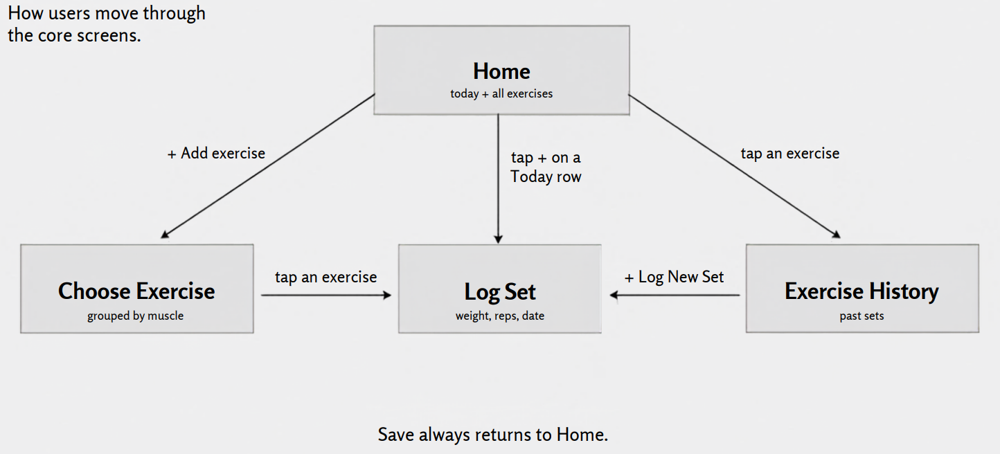
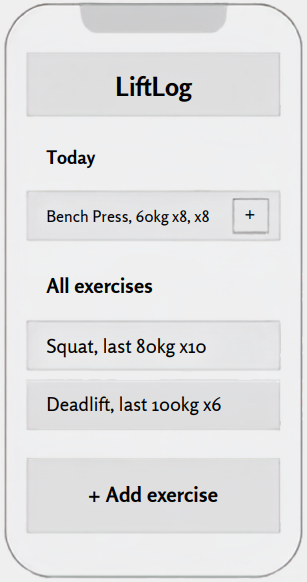
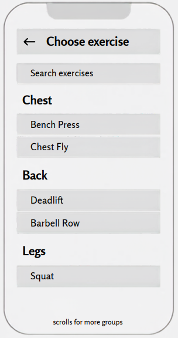
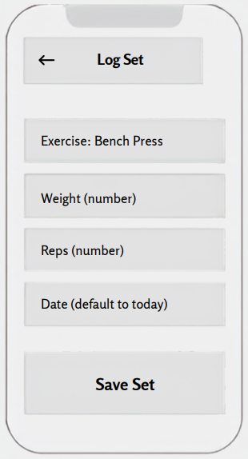
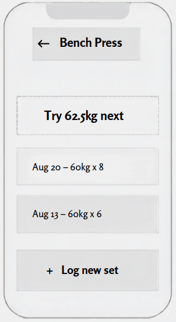

# Mockup

This is the approved mockup from the planning phase, plus real screenshots
of the shipped app in `screenshots/`.

## Screen flow

How a user moves through the four core screens.

- **Home** (today + all exercises)
  - "+ Add exercise" goes to Choose Exercise
  - tap + on a Today row goes to Log Set
  - tap an exercise goes to Exercise History
- **Choose Exercise** (grouped by muscle)
  - tap an exercise goes to Log Set
- **Log Set** (weight, reps, date)
- **Exercise History** (past sets)
  - "+ Log New Set" goes back to Log Set

Save always returns to Home.

### Visual Screen Flow

## Home screen

The same simple layout, optimized for every screen.

## Choose Exercise screen

Browse and search exercises by muscle group.

## Log Set screen

Record a single set with all key details.

## Exercise History screen

A clear view of past sets and what to try next.

## Component breakdown

The building blocks of the app, organized from basic elements to complete
screens. `src/components` folder.

| Atoms | Molecules | Organisms | Pages |
| --- | --- | --- | --- |
| Button | FormField | Header | HomePage |
| Input | ExerciseListItem | ExerciseList | ChooseExercisePage |
| Label | ExercisePickerRow | ExercisePicker | LogSetPage |
| Text | SetListItem | SetForm | ExerciseHistoryPage |
| | SuggestionBox | SetHistoryList | |

## Screenshots of the shipped app

Real screenshots are in `screenshots/` in this folder:

### Home

### Choose Exercise

### Log Set

### Exercise History

### Empty state

